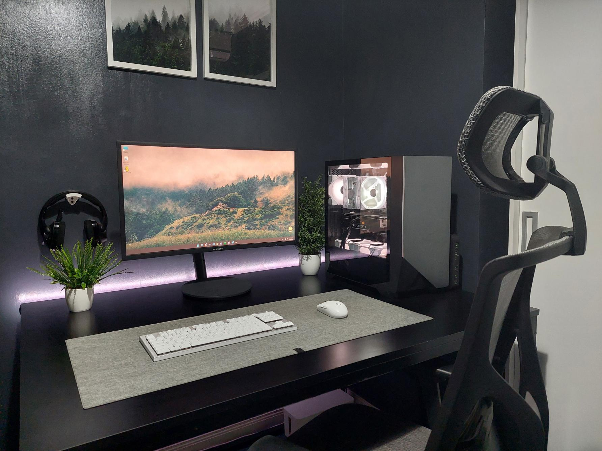

# Documentación de Mi Proyecto

Bienvenido a la documentación del proyecto.

Este sitio fue creado con **MkDocs** y publicado con **GitHub Pages**.

## Secciones

- [Instalación](instalacion.md)
- [Uso](uso.md)

!!! tip "Objetivo"
    Esta documentación muestra cómo instalar, configurar y usar el proyecto.

## Imagen del proyecto

